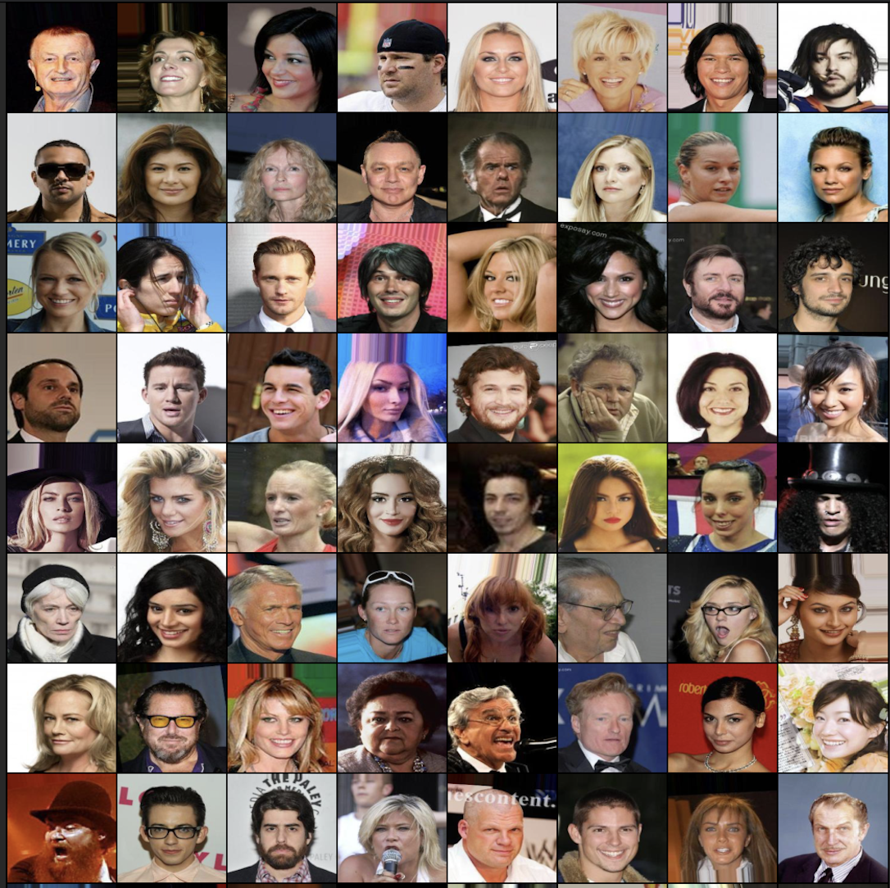
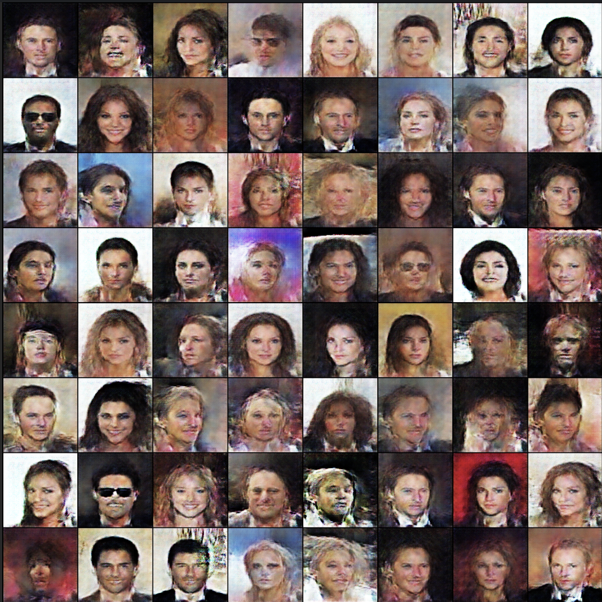
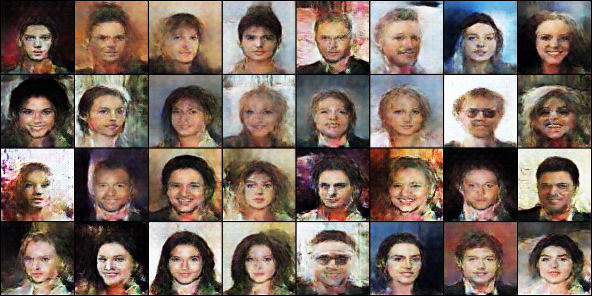

# VAE-GAN-PYTORCH
___

This repository implement the **VAE-GAN** proposed in "Autoencoding beyond pixels using a learned similiarity metric" using pytorch 

## Dependencies
___
We use the following Python packages to implement this.    
* fire 0.4.0
* loguru 0.5.3
* numpy 1.21.5
* pandas 1.3.5
* scipy 1.7.3
* torch 1.10.1
* torchvision 0.11.2
* tqdm 4.62.3

To install the above packages, type the following on your terminal:  
```
pip install -r requirements.txt
```

## Datasets
___
This implementation use **CelebA** dataset, which has huge human face images. You can download the dataset from this [link](https://mmlab.ie.cuhk.edu.hk/projects/CelebA.html).  
But you can also apply this model to other images with RGB channels.   
 

## Usage
___
You can run this project to simply type the following in your terminal:
```bash
python3 ./src/main.py\
        --datadir "./datasets/"\
        --lr 3e-4\
        --nepoch 20\
        --gamma 15\
        --beta 5\
        --zdim 128\
        --device 'cuda'\
        --batchsize 64\
        --early_stopping None
```

| Arguments     | Explanation       | Default       | 
| --------------|-------------------|:-------------:|
| `datadir` | Directory of dataset | `./datasets/` |
| `lr` | Learning rate | `3e-4`|
| `nepoch` | Maximum number of epochs to train | `20`|
| `gamma` | Weight value between reconstruction and discrimination | `15`|
| `beta` | Weight value between KLD and reconstruction | `5`|
| `zdim` | Dimension of latent space | `128`|
| `device` | Training device | `cuda`|
| `batchsize` | Batch size of training data |`64`|
| `early_stopping` | Extra iterations before early-stopping | `None`|

## Experiments

### Input Images 
<p align="center"></p>

### Reconstruction Images after 5 epochs
<p align="center"></p>

### Random Generated Images from prior after 5 epochs
<p align="center"></p>

## References
[1] Larsen, Anders Boesen Lindbo, et al. "Autoencoding beyond pixels using a learned similarity metric." International conference on machine learning. PMLR, 2016.  
[2] https://github.com/ry85/VAE-GAN  
[3] https://github.com/a514514772/Pytorch-VAE-GAN
